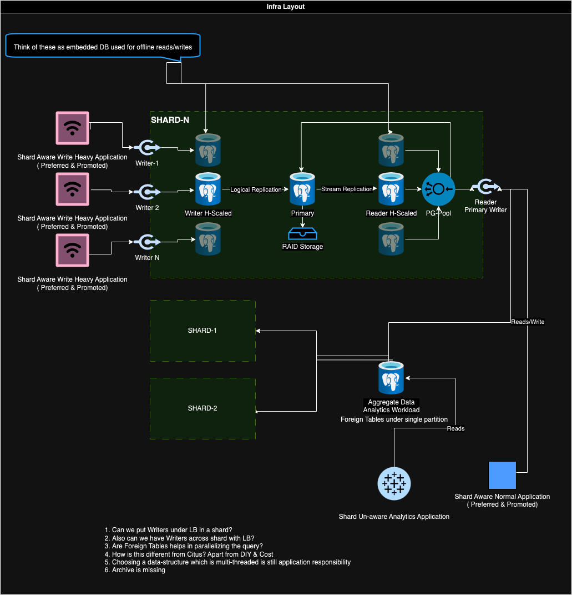

Requirements

A table microservice should have following

1. Keyset type efficient pagination(This can be acived by adding timestamp col)
2. Multiple Reader (H-Scalling)
3. Multiple Writter (H-Scalling)
4. Auto partitioning.
5. Auto Archival
6. Ring buffer
7. Expiry
8. Flexible schema
